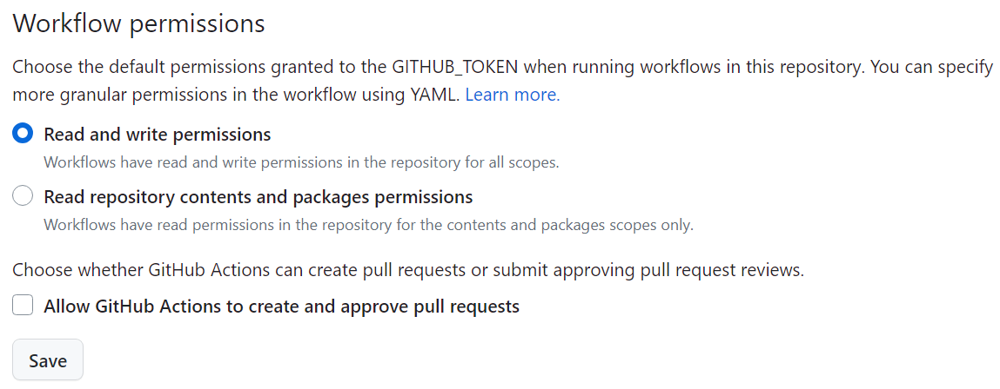

# Oktoberfest CV

[](https://github.com/aerabi/hacktoberfest-cv/releases/latest/download/main.pdf)


You can download the latest CV release as PDF by clicking
[](https://github.com/aerabi/hacktoberfest-cv/releases/latest/download/main.pdf)
badge. To access the older versions, navigate to the [Releases](https://github.com/aerabi/hacktoberfest-cv/releases) section on the right.

This is the CV I created the first draft of, on Oktoberfest 2017.

I'd highly recommend having a look at my [YouTube video](https://youtu.be/DMwbXN3QKbs) on building your CV with Docker and GitHub Actions before you try to implement this on your own.

<!-- [](https://www.youtu.be/DMwbXN3QKbs) -->

<a href="https://www.youtu.be/DMwbXN3QKbs">
  
</a>

If you have any issues, you can [create an issue](https://github.com/aerabi/hacktoberfest-cv/issues/new/choose) and add the details there.

# Table of Contents

- [LaTeX Compiling](#latex-compiling)
- [Creating Releases (`git tag` and GitHub Actions)](#creating-releases)

## LaTeX Compiling

Take your `.tex` file that you have used to create your resume (either via [Overleaf](https://www.overleaf.com/) or in a local environment) and check if there are no errors in the file, and it compiles successfully.

💻 **NOTE:** If you do not want to setup a local environment for running your $\LaTeX$ code, feel free to check out [cr2007/CV](https://github.com/cr2007/CV).<br>
He has used this project and modified it such that you can use **GitHub Codespaces** to easily create your own coding environment on the browser.

If you have [Docker](https://www.docker.com/) installed, you can also build the container locally in VS Code and code it there.

There is also a [bash script](https://github.com/cr2007/CV/blob/main/create_tag.sh) that will automate the entire process.


## Creating Releases

1. Make sure that you have enabled **Read and write permissions** enabled in the repository settings.

You can check it by going to your repository settings.

**Settings** > **Code and automation** > **Actions** > **General**

And then scroll down to **Workflow permissions**.

And select the **Read and write permissions** option




2. Type the following in the terminal to add a **tag** to your latest commit

```bash
git tag <tag-name>
```

Replacing `<tag-name>` with your version number (i.e. `v0.1.0`, etc.)

💡 If you want to tag a **particular commit** (maybe one with the latest $\LaTeX$ change), you can enter `git tag <tag-name> <commit-hash>`

Which will tag only that particular commit instead.

3. **Push** your tag to the main branch

```bash
git push origin <tag-name>
```

Replacing `<tag-name>` with your version number (i.e. `v0.1.0`, etc.)

Once that's done, the GitHub Actions workflow will be triggered and compile the $\LaTeX$ source code.<br>
Once the code has been compiled, you will see the compiled PDF in the Releases page.

You can check the progress of the workflow by clicking on the **Actions** tab

The badges at the top will also be updated automatically.
